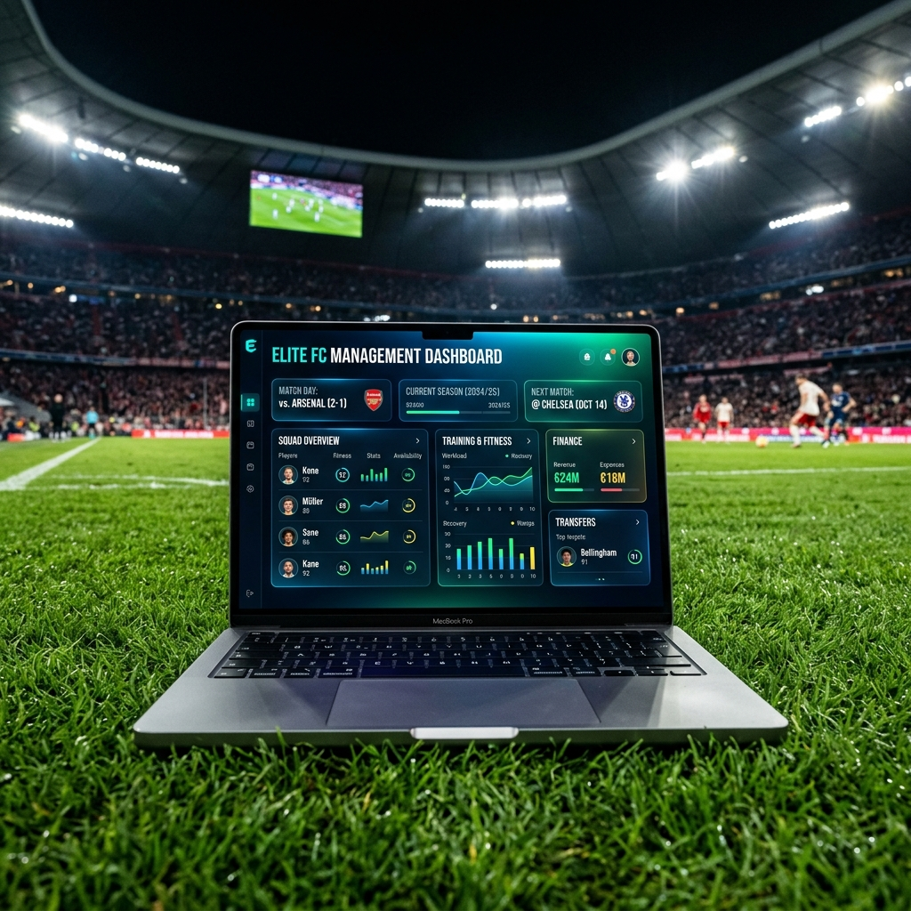
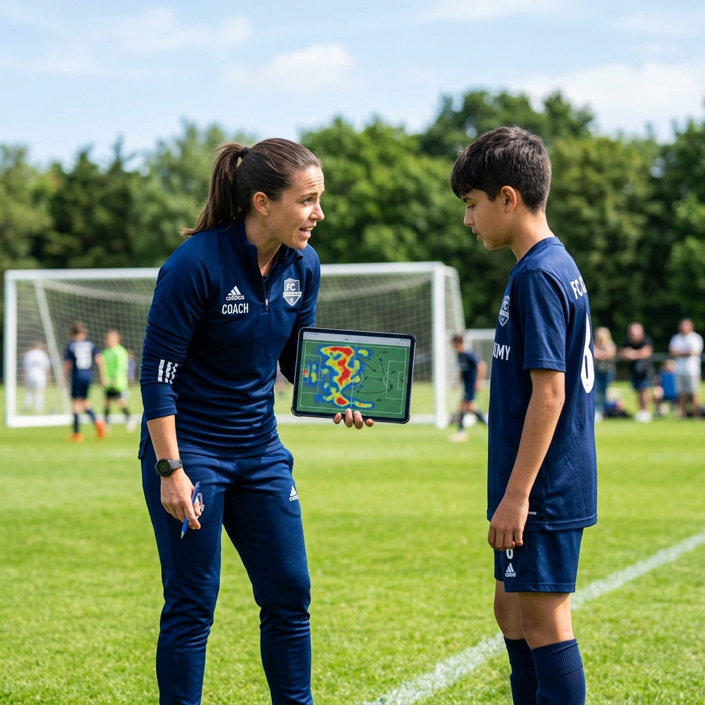
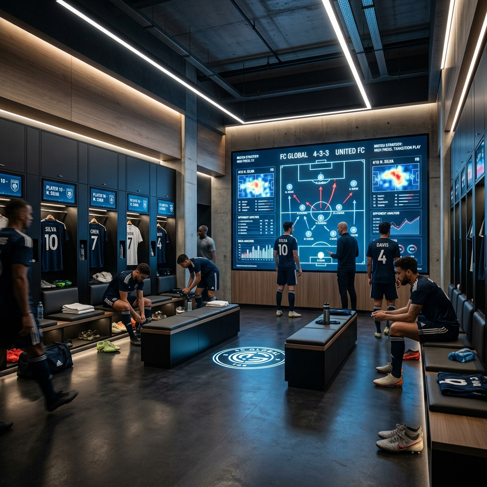
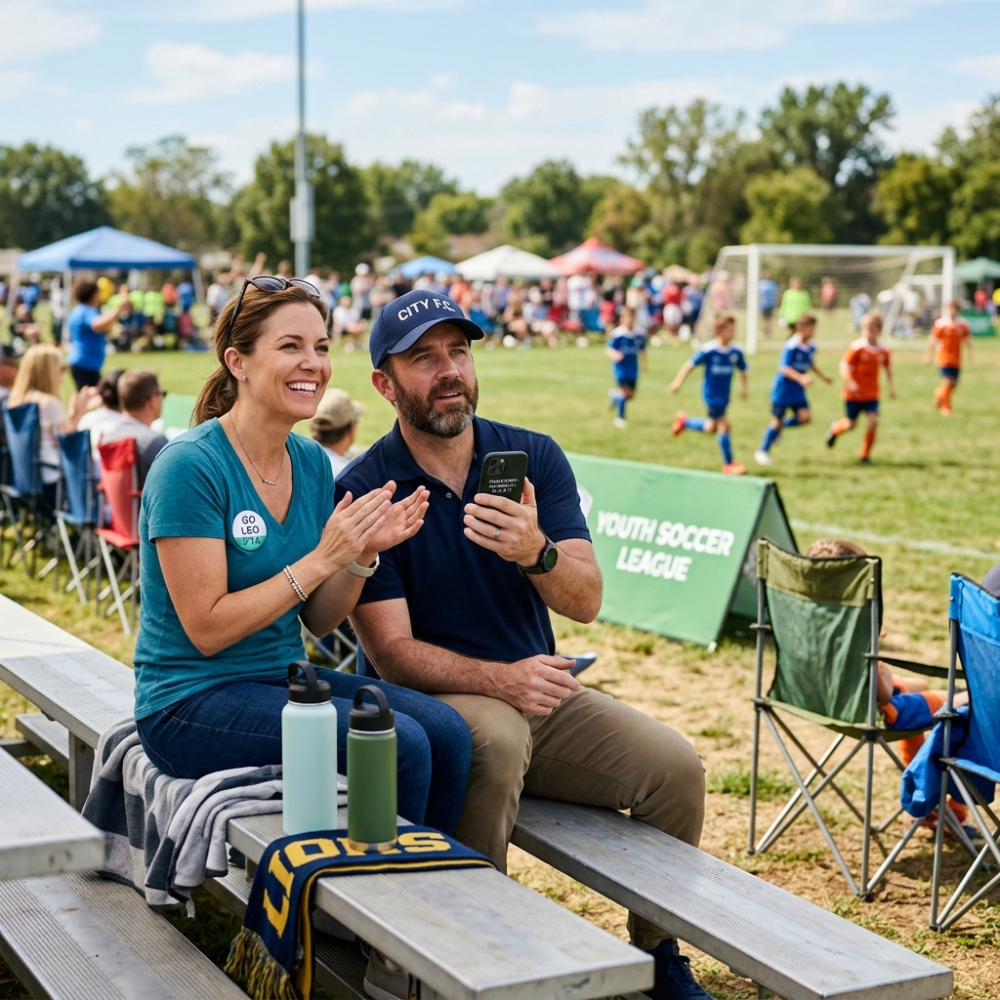
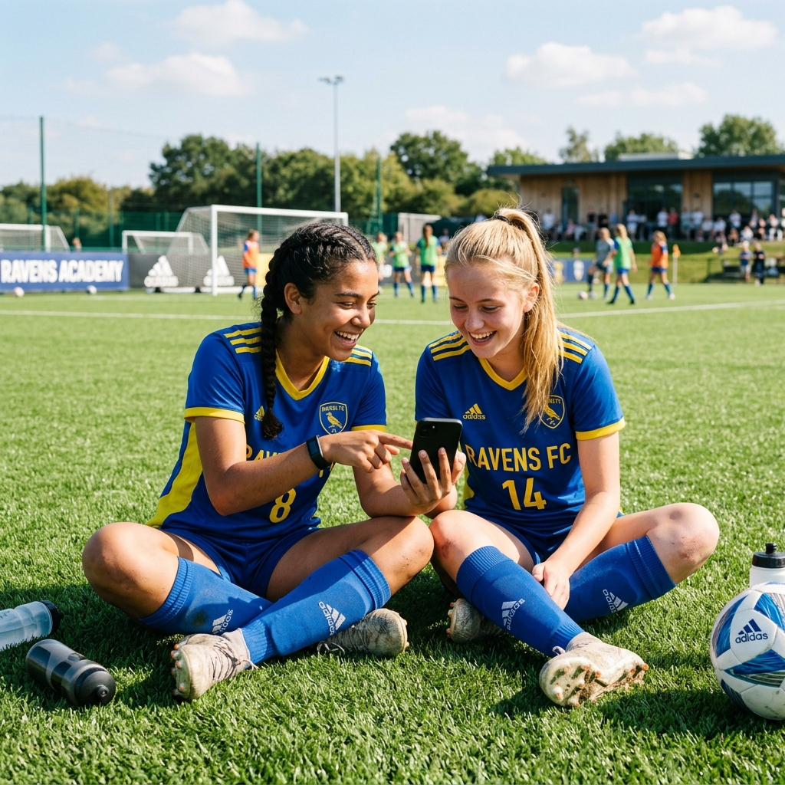
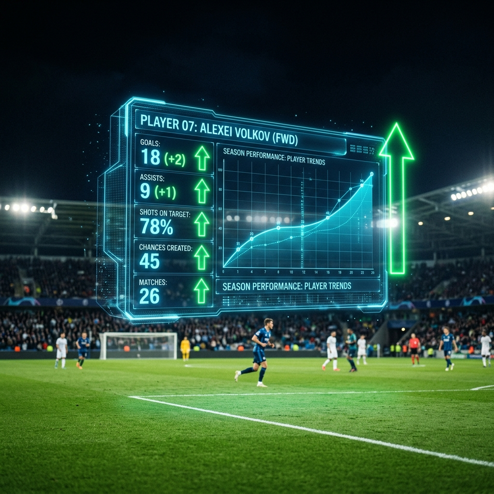
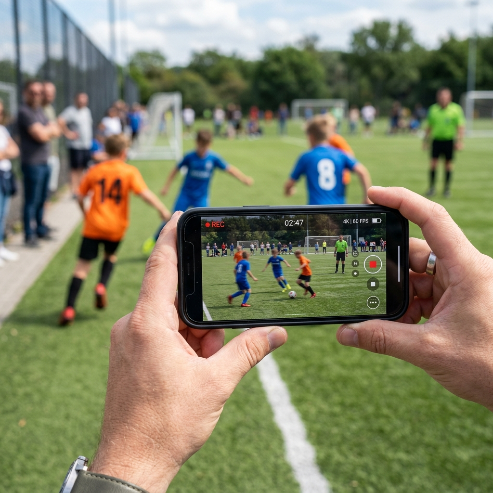

# Resumo Executivo: Projeto AthleteOS

Este documento consolida o estado atual do projeto **AthleteOS**, detalhando o que foi construído, a estrutura do planejamento atual e onde localizar cada componente no seu ambiente de desenvolvimento.

---

## 1. O que criamos (Funcionalidades e Código)

O projeto evoluiu de um simples aplicativo de atleta para o **AthleteOS**, um ecossistema B2B completo de scouting e gestão esportiva. Até o "Sprint 18" (detalhado no nosso Relatório Executivo), as seguintes fundações e módulos foram estruturados:

*   **Vitrine 360° do Atleta:** Página pública otimizada com estatísticas, gráficos de evolução de performance ao longo do tempo e integração de vídeos.
*   **Portal de Scouting e Buscador Inteligente:** Ambiente para olheiros e treinadores filtrarem, avaliarem e buscarem atletas com filtros granulares.
*   **Motor de Avaliação e IA (Insights):** Avaliações multidimensionais (tática, técnica, mental e física) com geração de gráficos radar e alertas de sobrecarga/recomendações via IA.
*   **Video Annotator:** Sistema de *tagging* profissional para lances de jogos em vídeos do YouTube (marcações de tempo e ações).
*   **Plano de Desenvolvimento Individual (PDI) e Dashboards:** Metas e checklists diários para os atletas, além de KPIs gerenciais para a diretoria do clube.
*   **Infraestrutura e Código Base:** Estruturamos um monorepo avançado usando **Turborepo e pnpm**. O código base está preparado com **Next.js**, banco de dados **Supabase** e autenticação.

---

## 2. Como est√° o nosso Planejamento

O nosso planejamento está extremamente robusto, profissional e organizado na **"AthleteOS Engineering Bible"** (Bíblia de Engenharia). 

Trata-se de uma documentação técnica completa dividida em 10 volumes. Esse planejamento garante que a Inteligência Artificial e a equipe de desenvolvedores possam criar e escalar o sistema de forma padronizada, sem perder o contexto das regras de negócio. 

Os 10 volumes incluem:
*   **Vol 1:** PRD (Product Requirements Document)
*   **Vol 2:** Arquitetura de Software
*   **Vol 3:** Banco de Dados
*   **Vol 4:** UI/UX (Telas e Fluxos)
*   **Vol 5:** IA e Prompts
*   **Vol 6:** Automações (n8n, webhooks)
*   **Vol 7:** Integrações Open Source
*   **Vol 8:** Plano de Execução (Sprints)
*   **Vol 9:** GitHub Blueprint (Estrutura do repositório)
*   **Vol 10:** Manual para IA (Regras de desenvolvimento automatizado)

---

## 3. Onde você acessa tudo (Mapeamento do Workspace)

Todo o ecossistema está localizado no diretório raiz do seu projeto: 
`C:\Users\zsand\Desktop\thomas futebol`

Abaixo est√° o mapa de onde encontrar cada elemento fundamental:

*   **📘 A Bíblia de Engenharia (O Planejamento):** Todos os 10 volumes estão na pasta `engineering-bible/`.
*   **💻 O Código-Fonte Oficial:** Todo o código do projeto está na pasta do monorepo `athleteos/` (contém as pastas de apps, packages, supabase, etc).
*   **📄 Relatório Geral de Funcionalidades:** Arquivo `athleteos_relatorio.md` na raiz do projeto.
*   **üí° A Proposta Original de Arquitetura:** Arquivo `athleteOS.txt` na raiz do projeto.
*   **📚 Manuais da FIFA (Base para regras de negócio):** Arquivos `FIFA TD Handbook.pdf` e `talent-identification-guideFIFA.pdf`.
*   **📁 Outras áreas experimentais:** Pastas como `app-scout/`, `dashboard/`, `banco dados/` e `site/`.

---

## 4. Onde estamos agora e Próximos Passos

Neste momento, temos a **fundação teórica e de engenharia perfeitamente documentada** (na Bíblia de Engenharia) e um **repositório inicial configurado** (`athleteos/`). 

Os próximos passos naturais envolvem a execução sistemática dos Sprints definidos na Bíblia de Engenharia (Volume 8), começando pela estruturação do Banco de Dados no Supabase (Volume 3) ou desenvolvimento da UI (Volume 4).

## 5. Telas do Sistema (Prints)

Essas s„o as capturas de tela do sistema rodando no Localhost:

### Dashboard de Clubes

### Vesti·rio Digital

